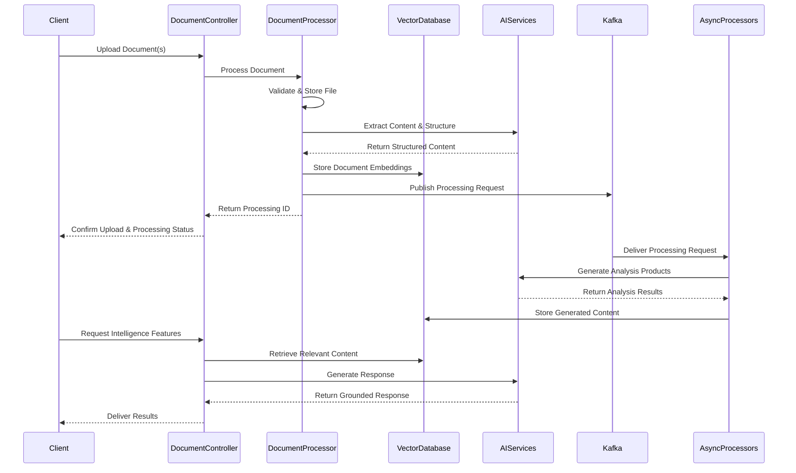

# Comprehensive AI Document Intelligence Platform

This document outlines the architecture and capabilities of a sophisticated Spring Boot application for AI-powered document analysis and content transformation. The platform processes documents through multiple stages of analysis, providing a rich set of features for knowledge extraction, summarization, and content generation.

## Core Architecture

The system follows a service-oriented architecture with clean separation of concerns:

1. **API Layer**: RESTful endpoints for document upload and intelligence features
2. **Service Layer**: Core business logic with AI integration
3. **Data Layer**: Vector database and structured storage
4. **Messaging Layer**: Event-driven processing via Kafka

## Document Processing Pipeline



## Key Intelligence Capabilities

### 1. Document Summarization

The platform provides multi-level document summarization:

- **Executive Summaries**: Concise overviews for decision-makers
- **Detailed Summaries**: Comprehensive analysis with structure preservation
- **Topic-Based Summaries**: Focused summaries on specific themes or aspects
- **Progressive Summarization**: Layered summaries at increasing levels of detail

Implementation highlights:

```java
@Service
public class SummaryService {
    private final VectorStoreService vectorStore;
    private final AIClient aiClient;
    
    public SummaryResponse generateSummary(String documentId, SummaryType type, Integer length) {
        Document document = documentRepository.findById(documentId)
            .orElseThrow(() -> new DocumentNotFoundException(documentId));
            
        // Select appropriate prompt template based on summary type
        Resource promptTemplate = getSummaryPromptTemplate(type);
        
        // Create structured prompt with document content
        PromptTemplate template = new PromptTemplate(promptTemplate);
        Prompt prompt = template.create(Map.of(
            "document", document.getContent(),
            "type", type.toString(),
            "length", length
        ));
        
        // Generate summary using AI
        String summary = aiClient.prompt(prompt).call().content();
        
        return SummaryResponse.builder()
            .summary(summary)
            .documentId(documentId)
            .summaryType(type)
            .generatedAt(Instant.now())
            .build();
    }
}
```

### 2. Question Answering

The system provides document-grounded question answering:

- **Precise Answers**: Targeted responses to specific questions
- **Citation Support**: Answers linked directly to source content
- **Multi-Document Reasoning**: Answers synthesized across multiple documents
- **Knowledge Boundaries**: Clear indication of what is and isn't in the documents

Implementation approach:

```java
@Service
public class DocumentQAService {
    private final VectorStoreService vectorStore;
    private final AIClient aiClient;
    
    public AnswerResponse answerQuestion(Question question) {
        // Retrieve relevant document chunks from vector database
        List<DocumentChunk> relevantChunks = vectorStore.similaritySearch(
            question.getText(), 
            10, 
            question.getDocumentConstraints()
        );
        
        // Build context from retrieved chunks with citation markers
        String context = buildDocumentContext(relevantChunks);
        
        // Generate answer with AI model
        String response = aiClient.prompt()
            .systemMessage(getQASystemPrompt())
            .userMessage("Question: " + question.getText() + "\n\nContext: " + context)
            .call()
            .content();
            
        // Extract and verify citations from response
        List<Citation> citations = extractAndVerifyCitations(response, relevantChunks);
        
        return AnswerResponse.builder()
            .answer(response)
            .citations(citations)
            .confidence(calculateConfidence(relevantChunks, question))
            .build();
    }
}
```

### 3. Idea Generation & Brainstorming

The platform enables document-grounded creative ideation:

- **Concept Extraction**: Identifying key concepts for exploration
- **Related Ideas**: Generating associated concepts and perspectives
- **Conceptual Networks**: Creating mind maps and idea relationships
- **Novel Combinations**: Suggesting unexpected connections between ideas

Technical implementation:

```java
@Service
public class IdeaGenerationService {
    private final VectorStoreService vectorStore;
    private final AIClient aiClient;
    
    public IdeaResponse generateIdeas(IdeaRequest request) {
        // Collect relevant content from documents
        List<String> documentIds = request.getDocumentIds();
        String topic = request.getTopic();
        
        // Extract relevant passages from documents
        List<DocumentChunk> relevantChunks = vectorStore.retrieveRelevantChunks(
            topic, 
            documentIds, 
            20
        );
        
        // Generate ideas using AI with structured prompt
        String ideasResponse = aiClient.prompt()
            .systemMessage(getIdeaGenerationPrompt(request.getIdeaType()))
            .userMessage(buildIdeaGenerationContext(relevantChunks, topic, request))
            .call()
            .content();
            
        // Process and structure the generated ideas
        return parseIdeaResponse(ideasResponse, request.getIdeaType());
    }
}
```

### 4. Complex Topic Explanation

The system breaks down complex topics into clear explanations:

- **Multi-Level Explanations**: From beginner to expert-level explanations
- **Conceptual Breakdown**: Decomposing complex ideas into manageable components
- **Analogies & Examples**: Generating clarifying examples from document content
- **Visual Representations**: Creating concept maps and relationship diagrams

Service implementation:

```java
@Service
public class ExplanationService {
    private final VectorStoreService vectorStore;
    private final AIClient aiClient;
    
    public ExplanationResponse explainTopic(String topic, List<String> documentIds, ExplanationLevel level) {
        // Find relevant content about the topic
        List<DocumentChunk> relevantContent = vectorStore.findRelevantContent(topic, documentIds);
        
        // Generate explanation based on level (beginner, intermediate, expert)
        String explanation = aiClient.prompt()
            .systemMessage(getExplanationSystemPrompt(level))
            .userMessage(buildExplanationPrompt(topic, relevantContent))
            .call()
            .content();
            
        // Generate supporting materials based on explanation type
        List<Example> examples = generateExamples(topic, relevantContent, level);
        List<Analogy> analogies = generateAnalogies(topic, relevantContent);
        
        return ExplanationResponse.builder()
            .explanation(explanation)
            .examples(examples)
            .analogies(analogies)
            .citations(extractCitations(explanation, relevantContent))
            .build();
    }
}
```

### 5. Content Creation Assistance

The platform assists in creating document-grounded content:

- **Outlines & Drafts**: Structured content based on document insights
- **Study Materials**: Creating learning resources from complex content
- **Presentation Content**: Generating slides and talking points
- **Communications**: Drafting emails and messages based on document context

Implementation strategy:

```java
@Service
public class ContentCreationService {
    private final VectorStoreService vectorStore;
    private final AIClient aiClient;
    
    public ContentResponse createContent(ContentRequest request) {
        // Get document sources and content type
        List<String> documentIds = request.getDocumentIds();
        ContentType contentType = request.getContentType();
        String topic = request.getTopic();
        
        // Retrieve relevant content from documents
        List<DocumentChunk> relevantChunks = vectorStore.retrieveRelevantContentForTopic(
            topic, 
            documentIds,
            25
        );
        
        // Select appropriate template based on content type
        Resource promptTemplate = getContentPromptTemplate(contentType);
        
        // Generate content using AI
        String generatedContent = aiClient.prompt()
            .systemMessage(promptTemplate)
            .userMessage(buildContentPrompt(topic, relevantChunks, request))
            .call()
            .content();
            
        // Structure and format content based on type
        return formatContentResponse(generatedContent, contentType, extractCitations(generatedContent, relevantChunks));
    }
}
```

### 6. Source Grounding & Citations

All platform responses maintain strong source grounding:

- **Precise Citations**: Linking generated content to source material
- **Citation Formats**: Supporting multiple academic and professional formats
- **Source Verification**: Ensuring accuracy of citations and references
- **Context Preservation**: Maintaining original context in cited material

Technical approach:

```java
@Service
public class CitationService {
    private final DocumentRepository documentRepository;
    
    public List<Citation> extractAndVerifyCitations(String content, List<DocumentChunk> sourceChunks) {
        // Extract citation markers from content
        List<CitationMarker> markers = extractCitationMarkers(content);
        
        // Verify each citation against source chunks
        List<Citation> verifiedCitations = new ArrayList<>();
        
        for (CitationMarker marker : markers) {
            Optional<DocumentChunk> sourceChunk = findSourceChunk(marker, sourceChunks);
            
            if (sourceChunk.isPresent()) {
                DocumentChunk chunk = sourceChunk.get();
                Document document = documentRepository.findById(chunk.getDocumentId()).orElse(null);
                
                verifiedCitations.add(Citation.builder()
                    .citationId(marker.getId())
                    .documentId(chunk.getDocumentId())
                    .documentTitle(document != null ? document.getTitle() : "Unknown")
                    .excerpt(chunk.getContent())
                    .location(formatLocation(chunk))
                    .build());
            }
        }
        
        return verifiedCitations;
    }
    
    public String formatCitationsInContent(String content, List<Citation> citations, CitationFormat format) {
        // Replace citation markers with properly formatted citations
        String formattedContent = content;
        
        for (Citation citation : citations) {
            String formattedCitation = formatCitation(citation, format);
            formattedContent = replaceCitationMarker(formattedContent, citation.getCitationId(), formattedCitation);
        }
        
        return formattedContent;
    }
}
```

### 7. Multi-Source Synthesis

The system synthesizes information across multiple documents:

- **Cross-Document Analysis**: Identifying connections between documents
- **Comparative Analysis**: Comparing perspectives across sources
- **Gap Analysis**: Identifying missing information and contradictions
- **Comprehensive Integration**: Creating unified frameworks from disparate sources

Implementation details:

```java
@Service
public class SynthesisService {
    private final VectorStoreService vectorStore;
    private final AIClient aiClient;
    private final DocumentRepository documentRepository;
    
    public SynthesisResponse synthesizeDocuments(SynthesisRequest request) {
        // Gather metadata about documents to synthesize
        List<Document> documents = documentRepository.findAllById(request.getDocumentIds());
        
        // Extract key sections based on synthesis focus
        Map<String, List<DocumentChunk>> documentSections = extractRelevantSections(
            documents, 
            request.getFocus()
        );
        
        // Generate synthesis using AI with structured template
        String synthesisContent = aiClient.prompt()
            .systemMessage(getSynthesisSystemPrompt(request.getSynthesisType()))
            .userMessage(buildSynthesisPrompt(documentSections, request))
            .call()
            .content();
            
        // Extract insights, connections and contradictions
        List<Insight> insights = extractInsights(synthesisContent);
        List<Connection> connections = identifyConnections(synthesisContent, documentSections);
        List<Contradiction> contradictions = identifyContradictions(synthesisContent, documentSections);
        
        return SynthesisResponse.builder()
            .content(synthesisContent)
            .insights(insights)
            .connections(connections)
            .contradictions(contradictions)
            .citations(extractCitations(synthesisContent, flattenSections(documentSections)))
            .build();
    }
}
```

## Technical Infrastructure

### Vector Database Integration

The platform uses PostgreSQL with pgvector for semantic search:

```java
@Service
public class VectorStoreService {
    private final PgVectorTemplate vectorTemplate;
    private final AIClient embeddingClient;
    
    public void storeDocumentChunks(String documentId, List<DocumentChunk> chunks) {
        // Generate embeddings for each chunk
        for (DocumentChunk chunk : chunks) {
            float[] embedding = generateEmbedding(chunk.getContent());
            chunk.setEmbedding(embedding);
            chunk.setDocumentId(documentId);
        }
        
        // Store chunks and embeddings in database
        vectorTemplate.saveAll(chunks);
    }
    
    public List<DocumentChunk> similaritySearch(String query, int maxResults, List<String> documentConstraints) {
        // Generate embedding for query
        float[] queryEmbedding = generateEmbedding(query);
        
        // Build search criteria
        VectorSearchCriteria criteria = VectorSearchCriteria.builder()
            .queryEmbedding(queryEmbedding)
            .maxResults(maxResults)
            .minSimilarity(0.7f)
            .build();
            
        // Add document constraints if provided
        if (documentConstraints != null && !documentConstraints.isEmpty()) {
            criteria.setDocumentIdFilter(documentConstraints);
        }
        
        // Execute search
        return vectorTemplate.findSimilar(criteria);
    }
    
    private float[] generateEmbedding(String text) {
        return embeddingClient.createEmbedding(text);
    }
}
```

### Event-Driven Processing with Kafka

The system uses Kafka for asynchronous document processing:

```java
@Service
@RequiredArgsConstructor
public class DocumentProcessingService {
    private final KafkaTemplate<String, DocumentProcessingMessage> kafkaTemplate;
    
    public void queueDocumentForProcessing(String documentId, ProcessingType type) {
        DocumentProcessingMessage message = DocumentProcessingMessage.builder()
            .documentId(documentId)
            .processingType(type)
            .timestamp(Instant.now())
            .build();
            
        kafkaTemplate.send("document-processing", documentId, message);
    }
}

@Service
@KafkaListener(topics = "document-processing", groupId = "document-processors")
public class DocumentProcessingConsumer {
    private final DocumentAnalysisService analysisService;
    private final SummaryService summaryService;
    private final VectorStoreService vectorStoreService;
    
    @KafkaHandler
    public void handleDocumentProcessing(DocumentProcessingMessage message) {
        String documentId = message.getDocumentId();
        ProcessingType type = message.getProcessingType();
        
        switch (type) {
            case INDEXING:
                vectorStoreService.indexDocument(documentId);
                break;
            case SUMMARIZATION:
                summaryService.generateSummaries(documentId);
                break;
            case FULL_ANALYSIS:
                analysisService.performFullAnalysis(documentId);
                break;
        }
    }
}
```

### AI Model Integration

The platform leverages Spring AI for model access:

```java
@Configuration
public class AIConfiguration {
    @Bean
    @Primary
    public ChatClient primaryAIClient(OpenAiChatModel model) {
        return ChatClient.create(model);
    }
    
    @Bean
    @Qualifier("embeddingClient")
    public EmbeddingClient embeddingClient(OpenAiEmbeddingModel model) {
        return EmbeddingClient.create(model);
    }
    
    @Bean
    @Qualifier("fallbackClient")
    public ChatClient fallbackAIClient(AnthropicChatModel model) {
        return ChatClient.create(model);
    }
    
    @Bean
    public BeanOutputConverter<SummaryResponse> summaryConverter() {
        return new BeanOutputConverter<>(SummaryResponse.class);
    }
}
```

## Enhanced Domain Model

The platform uses a rich domain model to represent documents and analysis:

```java
@Entity
@Table(name = "documents")
@Data
public class Document {
    @Id
    private String id;
    private String title;
    private String fileName;
    private String mimeType;
    private Long fileSize;
    private String uploadedBy;
    
    @CreatedDate
    private Instant createdAt;
    
    @Type(io.hypersistence.utils.hibernate.type.json.JsonType.class)
    @Column(columnDefinition = "jsonb")
    private Map<String, Object> metadata;
}

@Entity
@Table(name = "document_chunks", 
       indexes = {@Index(name = "idx_document_id", columnList = "documentId")})
@Data
public class DocumentChunk {
    @Id
    @GeneratedValue
    private Long id;
    
    private String documentId;
    private String content;
    private Integer chunkIndex;
    
    @Type(JsonBinaryType.class)
    @Column(columnDefinition = "jsonb")
    private Map<String, Object> metadata;
    
    @Type(VectorType.class)
    @Column(columnDefinition = "vector(1536)")
    private float[] embedding;
}

@Data
@Builder
public class AnswerResponse {
    private String answer;
    private List<Citation> citations;
    private Double confidence;
    private List<String> relatedQuestions;
}

@Data
@Builder
public class Citation {
    private String citationId;
    private String documentId;
    private String documentTitle;
    private String excerpt;
    private String location;
}
```

## Conclusion

This document intelligence platform transforms raw documents into structured knowledge and intelligent content through AI-powered analysis. By combining vector search, event-driven processing, and AI integration, the system provides a comprehensive suite of document intelligence capabilities that maintain strong grounding in source material while enabling sophisticated information extraction and content generation.

The platform's modular architecture allows for easy extension with new capabilities while maintaining a clean separation of concerns. The event-driven approach enables scalable, asynchronous processing of large document collections, while the vector database integration provides efficient semantic search across document content.
